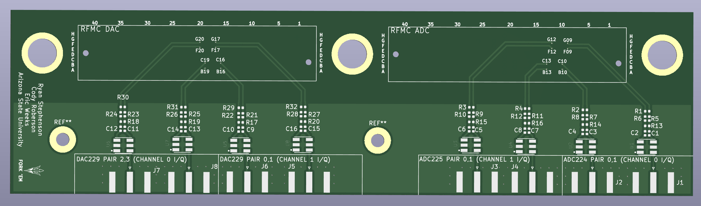
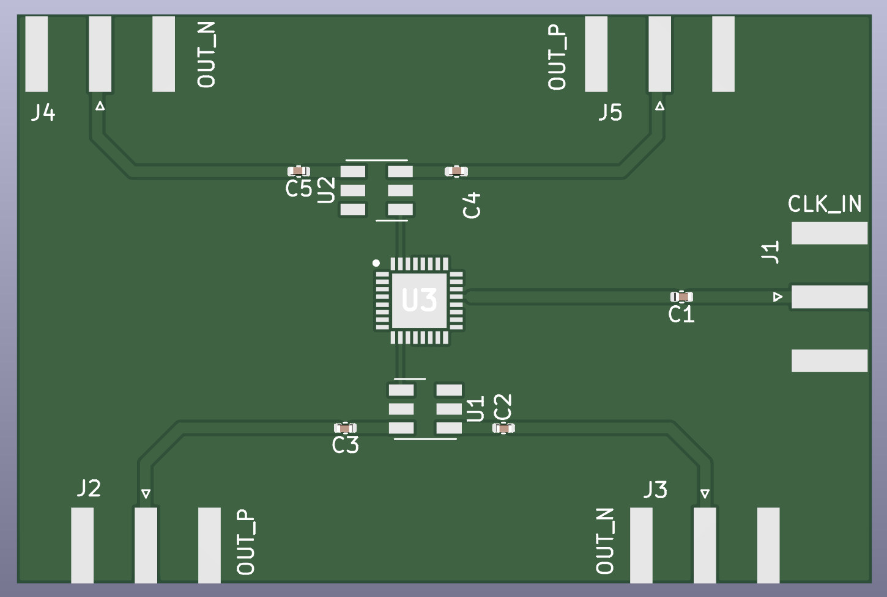

# RFSoC Breakout Board

This repo is for KiCAD6 projects replacing the FMC-XM500 daughter card with a smaller version using low frequency baluns and external differential clocking breakout board. 

## RFSoC_Frontend:

## RFSoC_directclocking:

---
signifigent contributions have been made by Eric Weeks and Cody Roberson at ASU to make this board operational.